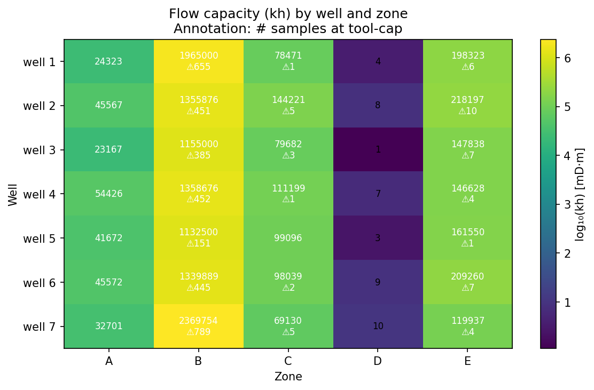
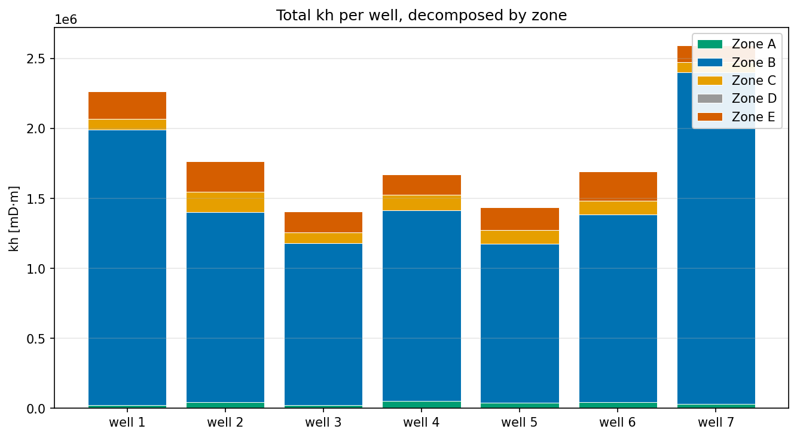
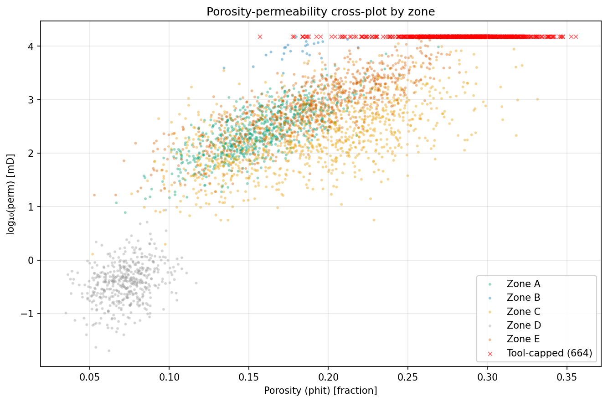
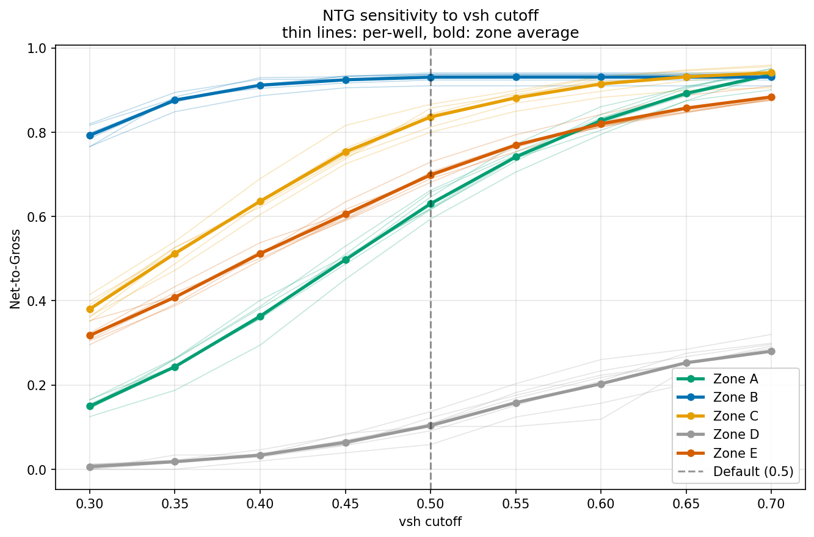
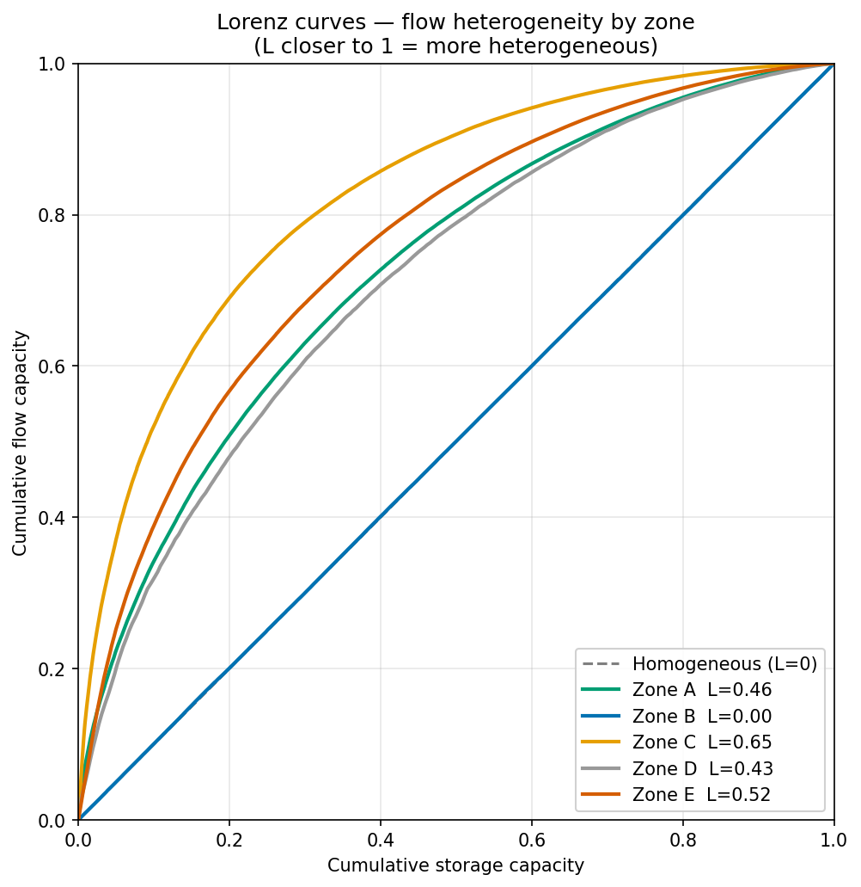
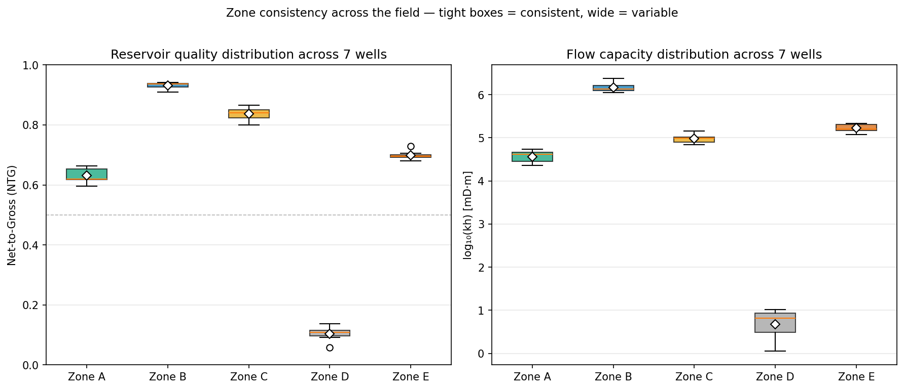

# Field-Level Visualizations — Part C.2

**Deliverable:** Six complementary visualizations that answer different
business questions about the field. Each chart is produced as both a
static PNG (for reports and slide decks) and an interactive HTML
(for the dashboard).

**Input:** `data/processed/master_table.parquet`, `metrics_per_zone.parquet`,
`sweep_results.parquet`.

**Output directory:** `outputs/figures/`

| # | Chart | Question it answers | Files |
|---|---|---|---|
| 1 | kh heatmap | Where in the field is flow capacity concentrated? | `01_kh_heatmap.png/.html` |
| 2 | kh stacked bar | How does each well's kh decompose by zone? | `02_kh_stacked_bar.png/.html` |
| 3 | phit-perm crossplot | What is the porosity-permeability relationship? | `03_phit_perm_crossplot.png/.html` |
| 4 | NTG sensitivity | How does net thickness respond to cutoff choice? | `04_ntg_sensitivity.png/.html` |
| 5 | Lorenz curves | How heterogeneous is flow within each zone? | `05_lorenz_curves.png/.html` |
| 6 | Zone-quality box plot | Which zones are consistently strong or weak across wells? | `09_zone_quality_boxplot.png/.html` |

---

## 1. Design principles common to all five charts

Before walking through each chart, three design decisions apply across
the set.

### 1.1 Colour palette (Wong, colour-blind safe)

All five charts use the same five-colour palette, picked from the Wong
palette (Nature Methods, 2011). Roughly 8% of male readers have red-green
colour vision deficiency; standard matplotlib defaults often place red
and green at the same lightness, which makes them indistinguishable. Wong
colours are chosen to remain distinct under all common forms of CVD.

The mapping is **fixed across every chart** — Zone B is always blue,
Zone D is always grey, and so on — so a reviewer can pattern-match across
the five views without consulting the legend each time.

| Zone | Colour | Hex | Rationale |
|---|---|---|---|
| A | Green | `#009E73` | Top reservoir, clean |
| B | Blue | `#0072B2` | Main flow zone (saturation-flagged) |
| C | Orange | `#E69F00` | Secondary reservoir |
| D | Grey | `#999999` | Tight rock / non-reservoir |
| E | Red | `#D55E00` | Deep reservoir |

### 1.2 Dual figure output (PNG + HTML)

Each chart function returns two figures — a matplotlib `Figure` and a
Plotly `Figure` — driven by the same prepared DataFrame. This costs a
small amount of duplicated rendering code but pays back in two ways:

- **Static PNG** for the report markdown, slide deck, and email shares.
- **Interactive HTML** for the dashboard — hover, zoom, filter — without
  re-running anything.

Because both come from the same data preparation step, the two outputs
are guaranteed to agree on the underlying numbers. Update one and the
other follows automatically.

### 1.3 Saturation is surfaced explicitly

Three of the five charts annotate or mark samples at the perm tool ceiling
(15,000 mD). Saturation is the dataset's biggest interpretation caveat;
hiding it in the data layer and quietly trusting the numbers would mislead
a reviewer. The charts make the censoring visible, so kh numbers are
read as lower bounds where appropriate.

---

## 2. Chart 1 — kh heatmap by (well, zone)

**Question:** Which (well, zone) combinations carry the field's flow
capacity, and where are those numbers most affected by tool saturation?



### How to read it

- **Rows** are wells (1–7); **columns** are zones (A–E).
- **Cell colour** encodes kh on a logarithmic scale (because kh ranges
  six orders of magnitude across the field — from ~1 mD·m in Zone D up
  to 2.4M mD·m in well_7 Zone B).
- **Cell annotations**: the upper number is kh; the lower number, where
  present, is the count of samples at the 15000 mD tool ceiling.

### What the chart shows

- **Zone B column is uniformly bright** — every well's Zone B is the
  brightest cell in that row. The field's main flow zone, as expected.
- **Zone D column is uniformly dark** — three orders of magnitude below
  every other zone. Tight rock confirmed at the field scale.
- **Well 7 Zone B is the brightest single cell** at 2.37M mD·m kh, but
  also carries the **highest saturation count** (789 samples capped).
  Both pieces of information are on the same cell, so a reviewer can't
  read the headline without seeing the caveat.
- **Zone E is the second-brightest column overall** — and crucially,
  Zone E cells show low saturation counts (4–10 samples). This is the
  field's most defensible high-kh zone.

### Design note: log colour scale

Linear colour would collapse Zone D into near-black against everything
else; the eye would not be able to read variation within Zone D, nor
within the high-kh zones. Log scale spreads the dynamic range across
the colour ramp evenly. A note on the colourbar makes the log
transformation explicit.

---

## 3. Chart 2 — kh stacked bar per well

**Question:** What does each well's total flow capacity look like, and
how much of it comes from which zone?



### How to read it

- One bar per well; bar height is total kh.
- Each colour segment is one zone's contribution to that well's kh.
- Zones are stacked in canonical order (A → E, bottom to top).

### What the chart shows

- **Bar heights identify well 7 as the field leader**, followed by
  well 1. The kh-by-well rollup from Part B is now visible at a glance.
- **Every bar is dominated by blue** — Zone B contributes 75–85% of every
  well's kh. Field strategy that targets aggregate kh is really targeting
  Zone B.
- **Zone D segments are invisible** — Zone D's kh (a few mD·m) is too
  small to show on a chart that spans 1M–2.5M mD·m. This visually
  reinforces the finding from the heatmap.
- **Zone E (red) shows as the second-thickest colour band** in every
  bar — a consistent secondary contribution to total kh across the field.

### Why stacked bars, not grouped bars

Grouped bars would let you compare zones to each other within a well, but
they wouldn't show the total. Stacked bars compress the comparison into
a single number per well (total height) while preserving the
decomposition. For ranking wells, total height is the right primary
visual; for ranking zones, the heatmap (Chart 1) is better.

---

## 4. Chart 3 — porosity vs permeability cross-plot

**Question:** How do porosity and permeability relate across the field,
and where do saturated samples sit in that relationship?



### How to read it

- Each dot is one depth sample (subsampled to ~20% for legibility).
- X-axis is porosity (`phit`); Y-axis is log10 of permeability.
- Colour encodes zone, using the fixed palette.
- **Red ×** markers overlay all samples at the 15000 mD tool ceiling,
  regardless of zone.

### What the chart shows

- **A clear porosity-permeability trend** — log(perm) climbs roughly
  linearly with phit, the classical petrophysical Carman-Kozeny shape.
  This is a sanity check that the data is internally consistent.
- **A horizontal red band at log(perm) = 4.18** — that's 10^4.18 ≈ 15000.
  Every red × sits exactly on this line because the tool censors at
  exactly that value. The line is not a geological feature; it is the
  instrument's upper measurement limit drawn directly on the data.
- **The red band is densest in the Zone B region** (high phit, blue
  dots) — visual confirmation that Zone B accounts for most of the
  saturated samples.
- **Zone D dots cluster at low phit AND low perm** (lower-left) — the
  tight-rock signature. Cutting vsh further does not move Zone D dots
  up; the limitation is the porosity/permeability of the rock itself.

### Design notes

- **Subsampling.** 18,167 sample points would overplot to a featureless
  cloud. 20% is plenty to show the trend and the cluster structure.
  Saturated samples are **not** subsampled — every red × is on the chart
  — so the censoring story is fully visible.
- **Red ×, not coloured-by-zone.** Saturated samples sit on top of every
  zone, and the message is "these are instrument-limited, not
  geological." A distinct symbol communicates that without colour
  conflict.

---

## 5. Chart 4 — NTG sensitivity to vsh cutoff

**Question:** How does each zone's net-to-gross respond to the choice
of vsh cutoff? This is the Part C.1 deliverable as a chart.



### How to read it

- X-axis is the vsh cutoff sweep (0.30–0.70).
- Y-axis is NTG_field for each zone at that cutoff.
- **Bold lines** are zone averages across the 7 wells.
- **Thin lines** are per-well trajectories (35 total, 7 per zone),
  showing inter-well spread.
- The dashed vertical line at vsh = 0.50 marks the literature default.

### What the chart shows

- **Zone B (blue, top)** is essentially flat above NTG = 0.79 for the
  entire sweep — robust by cleanliness.
- **Zone D (grey, bottom)** is essentially flat below NTG = 0.29 for
  the entire sweep — robust by tightness. **Same flat-line behaviour,
  opposite story.**
- **Zones A, C, E** all ascend smoothly through the default region,
  with steep slopes. A different cutoff choice would substantially
  change their reported volumes.
- **Thin lines stay close to the bold lines** for Zones B and D
  (consistent zone behaviour across wells) but spread more in Zones A
  and C — well-to-well variability is more interesting where the
  cutoff response is steep.

### Why this chart is the centerpiece of C.1

The Part C.1 narrative — "which findings survive any cutoff, which
depend on it?" — is the kind of question that text cannot answer
nearly as fast as a single panel. Two flat zones bracketing three
sensitive ones is the picture the reader takes away.

---

## 6. Chart 5 — Lorenz curves by zone

**Question:** How concentrated is the flow within each zone — does a
small fraction of the rock carry most of the kh?



### How to read it

- X-axis is the cumulative fraction of storage capacity (φ·dz sum,
  sorted by perm descending and normalised to [0, 1]).
- Y-axis is the cumulative fraction of flow capacity (k·dz sum, sorted
  the same way, normalised).
- The **dashed diagonal** is the perfectly homogeneous reference: a
  reservoir where every sample contributes equally to flow.
- Each curve traces one zone; **the further above the diagonal a curve
  arches, the more heterogeneous the zone is.**

### What the chart shows

- **Zones A, C, E** all show meaningful arc above the diagonal — Lorenz
  coefficients around 0.5–0.7. Real, measurable heterogeneity.
- **Zone D's curve** is shorter and noisier — there are very few net
  samples in Zone D (53 m field-wide), so the Lorenz construction is
  statistically thin.
- **Zone B's curve is glued to the diagonal** — Lorenz ≈ 0.001. **This
  is not a real homogeneity finding; it is a saturation artefact.**
  Because 99.85% of Zone B's net samples report exactly the same
  perm (15000 mD), they all contribute equally by definition. The
  instrument cannot distinguish between a real-perm "super-streak" of
  50,000 mD and one at 20,000 mD; both register as 15,000. Any Lorenz
  curve over a saturated zone collapses to the diagonal as an inevitable
  consequence.

### Why Lorenz despite the Zone B caveat

The Lorenz curve is the standard reservoir-engineering tool for flow
heterogeneity, and three of the five zones (A, C, E) produce meaningful
results. The Zone B caveat is itself a useful piece of information for
the reader: a flat Lorenz on a saturated zone signals "the tool can't
see the heterogeneity that is probably there." This is exactly the
information a production engineer needs before designing a sweep or
completion strategy for Zone B.

Zone C's Lorenz of ~0.65 is the headline number — it's the highest
heterogeneity among the meaningfully-measured zones, and it's what
motivates the sub-zone clustering in Part D.

---

## 7. Chart 6 — zone-quality box plot across the field

**Question:** Which zones are consistently strong or weak across the
field, and which show high well-to-well variability? This is the chart
that directly answers the case prompt:

> *"Which zones are consistently strong or weak across the field..."*



### How to read it

- **Two side-by-side panels.** Left: net-to-gross (NTG). Right:
  log₁₀(kh). Both panels use the same fixed zone palette.
- Each box summarises one zone's values across the 7 wells:
  - **Box height** spans the 25th–75th percentile (the interquartile range).
  - **Horizontal line inside** is the median.
  - **White diamond** is the mean.
  - **Whiskers** extend to min and max within 1.5× IQR.
- **Tight box = consistent across wells**; **wide box = wide
  well-to-well variability**.
- A dashed grey line at NTG = 0.5 on the left panel is a visual reference.

### What the chart shows

**Reservoir quality (NTG, left panel):**

- **Zone B sits at the top with a tight box** centred near 0.93 — every
  well in the field has a near-identical Zone B NTG. **Consistently
  strong, low variability.**
- **Zone D sits at the bottom with a tight box** centred near 0.10 —
  every well in the field has a near-identical low Zone D NTG.
  **Consistently weak, low variability.** The tight box around 0.10
  is the field-scale confirmation that Zone D is tight rock everywhere,
  not just in one or two wells.
- **Zone C is the middle box** at ~0.84 with a moderate spread,
  reflecting its internal heterogeneity (which Part D will explore).
- **Zone E** is slightly below Zone C, around 0.70.
- **Zone A** has the most variability (widest box) — some wells have
  Zone A at NTG ≥ 0.66, others below 0.60.

**Flow capacity (log kh, right panel):**

- **Five orders of magnitude separate the zones.** Zone B sits near
  log(kh) ≈ 6.2 (≈ 1.6M mD·m); Zone D sits near log(kh) ≈ 0.9 (≈ 8 mD·m).
  The log scale lets all five zones live on the same chart without
  collapsing.
- The same consistency story holds: **Zone B is consistently the
  flow champion, Zone D is consistently the floor**. Zones C, E, A
  occupy the middle in that order.

### Why this is the field-level chart the case prompts for

The case asks specifically for "which zones are consistently strong or
weak across the field". The other five charts each touch this question
indirectly:

- The heatmap shows it cell-by-cell — the reader has to scan and
  pattern-match.
- The stacked bar shows it implicitly through bar composition.
- The Lorenz curves and sensitivity curves answer different questions.

**The box plot answers it head-on.** A reviewer who looks only at this
chart learns in five seconds which zones are reliable contributors
across the field and which are not, without scanning a 7×5 grid of
cells.

### Design note: why two panels, not one

NTG (a fraction in [0, 1]) and kh (a positive value spanning six
orders of magnitude) need different y-axis scales. Forcing them onto
one chart would make the kh values incomparable, or would force a log
NTG that's hard to read. Side-by-side panels share the x-axis (zones)
so the patterns can be cross-checked at a glance: a zone consistent
in NTG is also consistent in kh, etc.

---

## 8. How the six charts work together

Each chart answers a different question; together they cover the field
from six complementary angles.

| Question | Chart |
|---|---|
| Where is the flow concentrated? | 1 (heatmap) |
| Which wells lead and why? | 2 (stacked bar) |
| Is the rock physics sane? | 3 (crossplot) |
| How sensitive is the result to my threshold choice? | 4 (sensitivity) |
| Is the flow uniform within each zone, or concentrated? | 5 (Lorenz) |
| **Which zones are consistently strong or weak?** | **6 (box plot)** |

A reviewer who looks at only one chart should pick the heatmap
(Chart 1) — it carries the most information per pixel. A reviewer with
five minutes should look at all six in the order above, which builds
the field-level story end-to-end:

1. The flow lives mostly in Zone B (heatmap).
2. Every well's kh is dominated by Zone B (stacked bar).
3. Most of Zone B is at the tool ceiling (crossplot).
4. The Zone B finding is robust to cutoff; the Zone D finding is also
   robust, but to the opposite conclusion (sensitivity).
5. Among the non-saturated zones, Zone C is the heterogeneous one
   worth sub-zoning (Lorenz).
6. Both findings (Zone B strong, Zone D weak) hold consistently across
   every well in the field — they're not driven by one outlier well
   (box plot).

---

## 9. How to reproduce

```bash
# Required: master table, metrics, and sweep results must already be cached
python -m src.cli quality   # produces master_table.parquet
python -m src.cli metrics   # produces metrics_per_zone.parquet
python -m src.cli sweep     # produces sweep_results.parquet

# Then generate all six charts (PNG + HTML each)
python -m src.cli field
```

All six charts are produced in `outputs/figures/`, with both `.png` and
`.html` variants for each.

Tests covering this module:

```bash
pytest tests/test_field_views.py -v
# 14 tests, 99% coverage of src/visualization/field.py
```